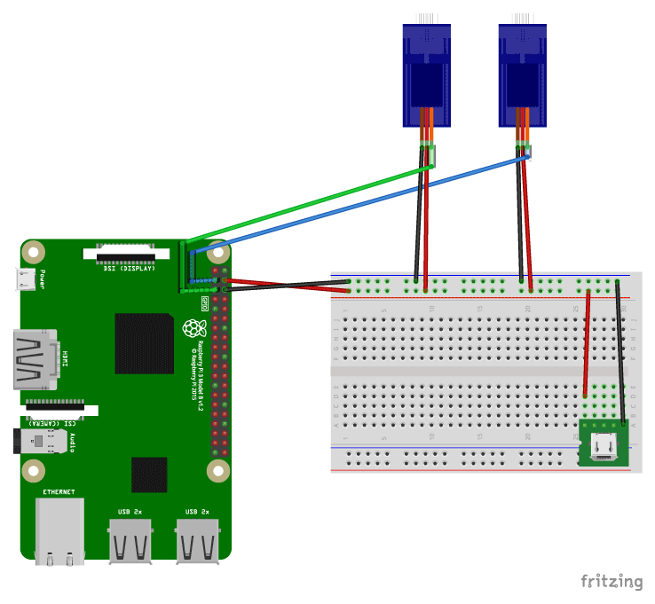

# Pan-Tilt-Follow

This demo shows how Python programs can gather data about the world around
them, process that data, and take actions accordingly.

<!--
    A picture of the device should go here after Andrew paints it
-->

## Hardware setup

To build your own, you’ll need:

  - A Raspberry Pi computer and camera. This can be as cheap as $70 with
    the minimum accessories, but could easily cost $150+ if you’re getting
    a comprehensive kit with the newest model.

    This is a tiny, cheap computer, based on smartphone parts,
    that has been made to run Linux for educational purposes. See
    [raspberrypi.org][] for more info.

    The newer ones are faster but more expensive. A Pi 3 or Pi 4 should
    work fine.

    You can usually buy these in person at [Memory Express][]. Online
    stores like [BuyaPi][] have more selection and better prices, but you
    often have to pay for shipping and wait a bit for it to come.

    Don’t forget the following accessories.

       - A power supply: micro-USB for all Pis except the Pi 4 which
         uses USB-C

       - A micro-SD card for the OS

       - An HDMI adapter may be needed: mini-HDMI for the Pi Zero, and
         micro-HDMI for the Pi 4

       - For a Pi Zero, you will also need a USB-OTG adapter, and may need
         a [longer camera cable][]

       - A case is nice but not strictly necessary

[raspberrypi.org]: https://www.raspberrypi.org
[Memory Express]: https://www.memoryexpress.com/Search/Products?Search=raspberry
[BuyaPi]: https://www.buyapi.ca
[longer camera cable]: https://www.buyapi.ca/product/raspberry-pi-zero-v1-3-camera-cable/

  - USB Micro-B connector breakout, [$2 at robotshop.com][micro-USB-breakout]

  - Pan-tilt kit, [$9 including servos][pt-kit-with-servo], or [$5 if you
    already have servos to re-use][pt-kit-no-servos].

[micro-usb-breakout]: https://www.robotshop.com/ca/en/usb-micro-b-connector-breakout-board.html
[pt-kit-with-servo]: https://www.robotshop.com/ca/en/pan-tilt-bracket-kit-single-attachment.html
[pt-kit-no-servos]: https://www.robotshop.com/ca/en/fpv-nylon-pan-tilt-kit-without-servo.html

  - Breadboard and jumper wires, purchasable standalone or as part of a
    [$35 introductory electronics kit](https://www.amazon.ca/dp/B06X3V84PV).
    Ones that come with [tutorials](http://www.freenove.com/tutorial.html)
    showing how to use all the included parts tend to be higher quality.

  - Assorted wood, screws, and double-sided tape, available at any hardware
    store.

### Circuit

A [Fritzing][] schematic is in the [`schematic`](schematic) folder.

[Fritzing]: https://fritzing.org/home/

The circuit is fairly straightforward: the pi and the servos all need
power, which is distributed using a USB breakout board plugged into a
breadboard.

And the two servos get their signal data from separate GPIO pins on the pi.

## Software setup

From a new install of raspbian:

  - At a terminal, run

        sudo systemctl enable pigpiod
        sudo systemctl start pigpiod

In `raspi-config`:

  - Enable camera

Recommended but not necessary:

  - Enable SSH

### Python

    pip3 install --user inputs
    sudo apt install -y python3-opencv opencv-data
    sudo apt install -y libhdf5-dev libatlas-base-dev libjasper-dev libqtgui4 libqt4-test

## Using it

To steer the camera with a gamepad, start

    main.py

Note that this can mess up the OpenCV python code later, possibly requiring
a reboot.

Then, to run the current face-track demo:

    python3 follow.py
